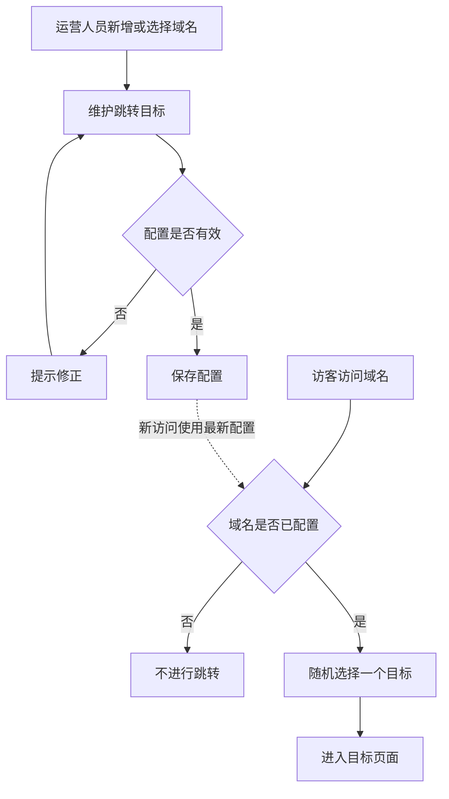

# 域名跳转业务功能概述

运营人员可按推广活动或渠道新增域名，为每个域名维护独立的跳转目标。一个域名可设置多个有效地址，支持添加、修改和移除，且至少保留一个目标。域名列表支持关键词搜索和目标数量筛选，方便快速查找并进入对应域名进行维护。访客访问已配置域名时，将随机进入其中一个目标页面；未配置域名不产生跳转。保存配置后，新访问应尽快使用最新目标。重复或无效地址应提示修正；多人同时修改同一域名时，应提醒先确认最新配置，避免覆盖他人的操作。新增域名投入使用前，仍需完成域名解析和访问入口配置。

## 业务流程图

